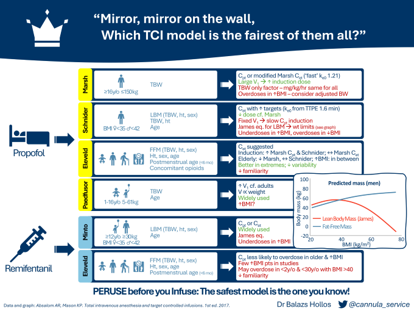
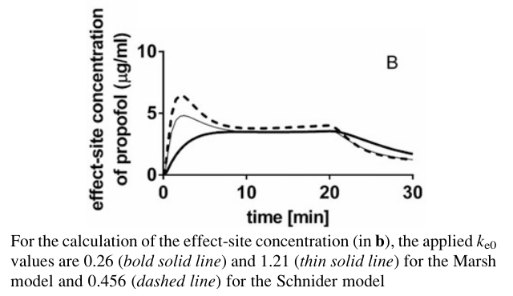
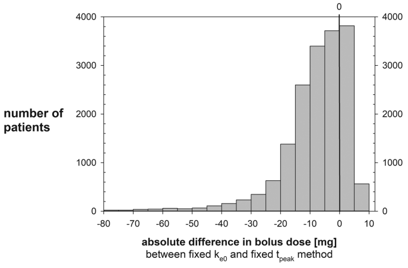
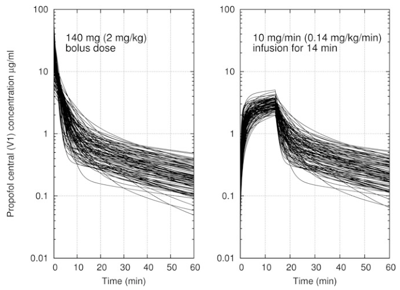

Which TCI model is the fairest of them all?
================================

*This document expands on a presentation I gave for the 2024 [SIVA ASM](https://www.sivameetings.co.uk/programme) infographic competition.*

([Click here](assets/TCImodels-SIVAinfographic-BHollos.pdf) for full sized PDF for downloading or sharing)

What I found surprising during my research was the variation in how models are implemented. You can't take for granted that using the same model between different pump manufacturers or different hospitals will result in the exact same behaviour.

Familiarity with equipment and standardisation are common themes in anaesthetic safety including TIVA. Such as Dr Rob Fleming's excellent [PERUSE before you Infuse](https://siva.ac.uk/joom2/index.php/resources/peruse). My takeaway from the research is to **know your model and stick with it**. Anaesthetic dosing is titrated to effect anyway, so by keeping your practice consistent you'll be able to reduce this as a source of error. If you want to try something new, expect there to be differences.

Unless otherwise referenced, data are taken from *Total Intravenous Anesthesia and Target Controlled Infusions* by Profs AR Absalom and KP Mason. I also recommend *An Overview of TCI & TIVA* by Profs Absalom and Struys as an excellent summary.

### General notes

* Induction speed will also depend on how your pump is programmed. Most pumps max out at 1200 mL/hr, but I've found induction set up at only 600 mL/hr. This doubles a 100mg induction from 30s to 60s which can make it feel a lot slower and the model can't be blamed for that. Check the specific device you use locally and how it's programmed, talk to clinical technology or your TIVA lead. 
* Models are built on aggregated data and no matter how many covariates are included they won't ever be able to tell you about the patient in front of you. Use your clinical judgement as you would usually. For example, in the elderly we know there is slower equilibration between blood and effect site, so use lower targets and wait longer. Propofol has a longer context sensitive half-life in children, so expect them to wake up more slowly.

Models
-------------------------

### Propofol

**Marsh**
* Total body weight (TBW) is the *only* covariate. Age is only required for licensing purposes to prevent use in children under 16. TBW is used in calculating V1 which is why induction is so fast, but also explains its limitations in severely obese and frail patients who may experience adverse haemodynamic effects with a larger dose. It has been suggested the use of adjusted body weight (ABW) offers a better compromise for reducing induction and maintenance doses in the obese.
* The model as implemented in Diprifusor by AstraZeneca included estimating a Ce with the original ke0 of 0.26 min-1 based on early pharmacodynamic data. Struys et al later proposed a faster ke0 of 1.21 min-1 (the 'modified' Marsh model) that would result in a time to peak effect (TTPE) of 1.6 min. [^1] This predicts a higher Ce, closer to that of Schnider, resulting in a smaller induction dose (see figure below).

* In the end AstraZeneca decided against implementing Ce targeting due to the added regulatory burden and the uncertainty around which ke0 to choose. Other manufacturers ended up implementing either of the two ke0 values leading to differing Ce estimations. BD Alaris PK pumps use the 'modified' model for example. Combined with the model's other limitations the general advice is to use Marsh exclusively in Cpt mode.

**Schnider**
* Schnider included more covariates than Marsh giving distinct advantages. The main limitation is its use of the James equation to calculate lean body mass (LBM). As the graph in the infographic shows this results in a paradoxically lower body mass over certain BMIs (35 in women, 42 in men). This is why you can't enter a higher weight on your pump.
* The effect of this is twofold: it overdoses in the underweight and underdoses the overweight. Unlike with Marsh it's not possible to replace LBM calculations without also altering the underlying model, so use of ABW is not advised.
* Because Schnider's model uses a fixed V1 of 4.27L the induction dose tends to be smaller than with Marsh resulting in a slower induction despite the same Ct. This leads to the suggestion of increasing your induction target concentrations if you want the speed of Marsh.
* Effect site control differs between various pump manufacturers due to the ke0 values used by predecessor devices. BD Alaris PK pumps calculate a ke0 for each patient based on a fixed TTPE of 1.6 min, whereas Fresenius TIVA Agilia and B Braun Perfusor Space pumps use a fixed ke0 of 0.456 min-1. [^2] (Both of these methods were included in the original description by Schnider[^3]). The effect of this is that on average a fixed ke0 results in a smaller bolus dose than a fixed TTPE depending on patient covariates. [^4]
* In a study of simulated inductions by Soehle et al based on characteristics of patients aged >15 anaesthetised in their insitituion in 2016 this resulted a median induction dose of 6mg less propofol with a fixed ke0. This is negligible but in some patients it can be as much as 70 or 80mg less, as shown in their graph below. [^4] The difference is particularly pronounced in younger patients as body weight increases, and this is true even below the limits of the James equation.

* The general advice is to stick with a fixed TTPE based algorithm unless you can be sure the population studied for the model and from where the ke0 is derived are the same. Ultimately with either technique once equilibrium is reached the maintenance rate of the infusion will be very similar to if Cpt was being used.

**Eleveld**
* Given the limitations of the previous models, Eleveld and colleagues set out to develop a general purpose model that could be used with a more diverse patient population. They analysed and combined existing data gathering 660 patients ages 3 months to 88 years, 5.2 to 160kg. They came up with a model that predicts compartment volumes with allometric scaling [^5], hoping to increase accuracy.
* They included a wide range of covariates as seen in the infographic. As compared to the previous models they used fat-free mass (FFM) estimated with the Al-Sallami equation. FFM is similar to LBM but excludes certain fat stores like intracellular lipids. The concomitant use of opioids is also a valuable inclusion as a covariate as it accounts for synergistic effects with propofol. This will be particularly relevant when propofol is used in isolation such as for procedural sedation.
* Its performance in predicting plasma concentrations of propofol was found to be similar to other models, but only Eleveld performed well over all groups (children, adults, obese adults, and the elderly). [^6] Laudably they also gathered BIS data from existing data sets hoping to incorporate this into their model to predict BIS values. [^7] Sadly though this didn't hold up as well in a recently published prospective trial, with unacceptable intra- and inter-patient differences. [^8]

**Paedfusor**
* Although no studies were conducted in children under 16 with the Marsh model, in the 90s Kataria and others had studied and published PK data on propofol in this population. Based on other PK data gathered by Schüttler [^9] the Diprifusor model was modified incorporating clearance and V1 as a function of age and weight to account for physiological differences. This used a much larger V1 than Marsh (458 vs 228 mL kg-1) slowly reducing it above the age of 12.
* This was validated for safety and efficacy in 6 month to 16 year olds by Morton becoming known as Paedfusor. [^10] The study and later studies however included few overweight children. [^11] With the 2021 PEACHY trial finding an obesity rate of 11.3% in children presenting for general anaesthesia in the UK [^12], this will become increasingly relevant for paediatric anaesthetists.

### Remifentanil

It's worth noting that studies on the pharmacodynamics of remifentanil models including Minto and Eleveld derive these from EEG parameters like spectral-edge frequency. Although associated with hypnotic effects these haven't been as well correlated with analgesic effects. A 2022 study by Abad-Torrent et al assessed the analgesic response to a 1.5 ng mL-1 remifentanil TCI (Minto Cet) by measuring the pain pressure threshold (PPT) using algometry in women undergoing minor gynaecological procedures. [^13] Cardiovascular responses stabilised after 5 mins, but PPT values increased for 15 mins even though the Minto model would have predicted stable remifentanil effect site concentrations.

**Minto**
* GlaxoSmithKline held the original patent for remifentanil, marketing it as Ultiva (GSK later sold their anaesthetics division to Aspen in 2017). They asked Dr John Glen [^14] and Prof Jürgen Schüttler to review the expansive literature around remifentanil TCI administration and to recommend a model that could be included in the marketing authorisation. They concluded that the Minto model provided the best overall fit.
* Although Minto had described a ke0 that reduced with age, GSK declined to include Ce targeting in their product recommendations. With remifentanil's rapid-onset and ultra-short acting characteristics, as well as its context insensitive half-life, it was felt that Cet provided little practical advantage over Cpt.
* Due to the reliance on the James equation for calculating LBM, Minto's model suffers from the same limitation as Schnider's propofol and therefore higher targets are advised in the obese to avoid underdosing.
* The limited benefits of Cet combined with the side effects of chest wall rigidity and bradycardia associated with a large bolus of remifentanil would suggest preferring Cpt.

**Eleveld**
* Prior to Eleveld's general purpose model being published in 2017 [^15], La Colla et al in 2010 had adapted Minto's model substituting the James equation for LBM with the Janmahasatian equation [^16]. This had performed well in obese and non-obese patients but had not been validated in children. In the same issue as Eleveld, Kim et al published their own general purpose model including data from a number of studies with obese patients. [^17] This performed similar to Minto and La Colla in non-obese and elderly patients, but better than La Colla in the obese.
* By contrast Eleveld had included paediatric data from children as young as 5 days, but no obese patients. Similar to the general purpose propofol model it included allometric scaling of compartment volumes with clearances. Interestingly they had found that clearance was reduced in children under 2, which was suggested to be due to the immaturity of the non specific esterases responsible for the breakdown of remifentanil. This was the opposite finding to the study they drew the data from by Ross et al, who found increased clearance in this group. [^18] Ross do note in their limitations that they only correlated with age, not with weight or body surface area which could explain the difference.

Does this really matter?
-------------------------

I ask myself this a lot when I see different techniques resulting in equally safely anaesthetised and comfortable patients. Even regional anaesthesia aficionados [mull over it](https://www.youtube.com/watch?v=ghmjQwBsOTs). [^19] It's both beautiful and maddening as a trainee!

There are countless studies looking at the bias (MDPE) and the accuracy (MDAPE) of these models, including comparing them with each other. [^6],[^7],[^8],[^12],[^15],[^20],[^21] They all perform reasonably well, some better than others in specific sub-populations. An editorial by Egan, Minto, and Schnider in the October 2024 issue of BJA accompanying the previously prospective trial of Eleveld in predicting BIS values convinced me it probably doesn't matter which model you choose. [^22]

Their argument revolves around the steady state kinetics offered by TCI models. As long as we know how the current number shown relates to the number before and we can therefore up- or down-titrate our dose, does an arbitrary Ct value really matter? Probably not. Inter-patient variability is large, often larger than the variation between models as some of the previous studies have shown. This is nicely illustrated in the figure below from Profs Absalom and Mason's textbook showing 100 simulated individuals undergoing propofol TCI with Eleveld.

The true plasma propofol concentration and its rate of equilibration with the effect site will depend on the patient in front of you and not what the pump calculates. So choose a model and learn it well.

References
-------------------------
[^1]: https://doi.org/10.1097/00000542-200002000-00021
[^2]: See product literature.
[^3]: https://doi.org/10.1097/00000542-199906000-00003
[^4]: https://doi.org/10.1097/EA9.0000000000000011
[^5]: Allometric scaling is a century old concept where not all physiological parameters scale linearly with size. In Eleveld's model compartment volumes scale linearly with normalised weight whilst clearances to the power of ¾. See: https://doi.org/10.1126/science.276.5309.122. This isn't a new idea in pharmacokinetics though, with Cortínez et al publishing a propofol PK model based on allometric scaling in 2010: https://doi.org/10.1093/bja/aeq195.
[^6]: https://doi.org/10.1016/j.bja.2020.10.027
[^7]: https://doi.org/10.1016/j.bja.2018.01.018
[^8]: https://doi.org/10.1016/j.bja.2024.06.041
[^9]: https://doi.org/10.1097/00000542-200003000-00017
[^10]: https://doi.org/10.1046/j.1460-9592.2002.00921.x
[^11]: https://doi.org/10.1016/j.bja.2021.09.007
[^12]: https://doi.org/10.1093/bja/aeg220
[^13]: https://doi.org/10.1016/j.bja.2022.08.026
[^14]: The same Dr John B Glen who wrote the chapter in Profs Absalom and Mason's TIVA bible that the information in this section is taken from (as well as being SIVA's first honorary member).
[^15]: https://doi.org/10.1097/ALN.0000000000001634
[^16]: https://doi.org/10.2165/11317690-000000000-00000
[^17]: https://doi.org/10.1097/ALN.0000000000001635
[^18]: https://doi.org/10.1097/00000539-200112000-00008
[^19]: This is definitely a bit of jealously for their voodoo like regional skills.
[^20]: https://doi.org/10.1093/bja/aex243
[^21]: https://doi.org/10.1016/j.bja.2020.05.051
[^22]: https://doi.org/10.1016/j.bja.2024.07.014